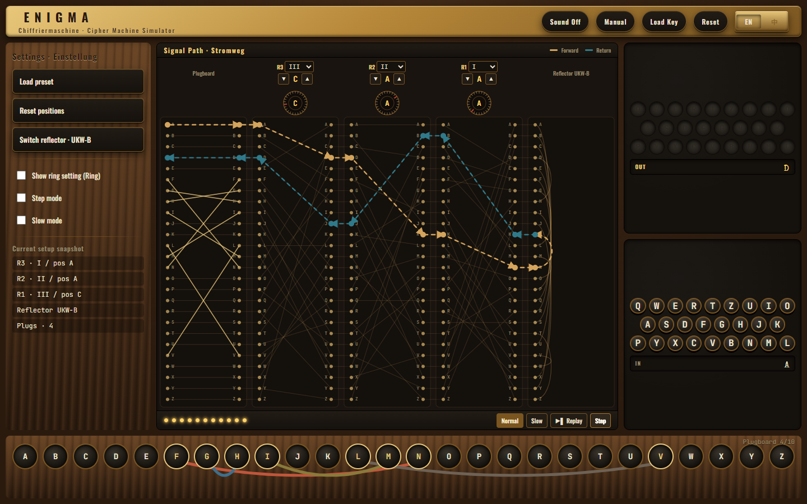
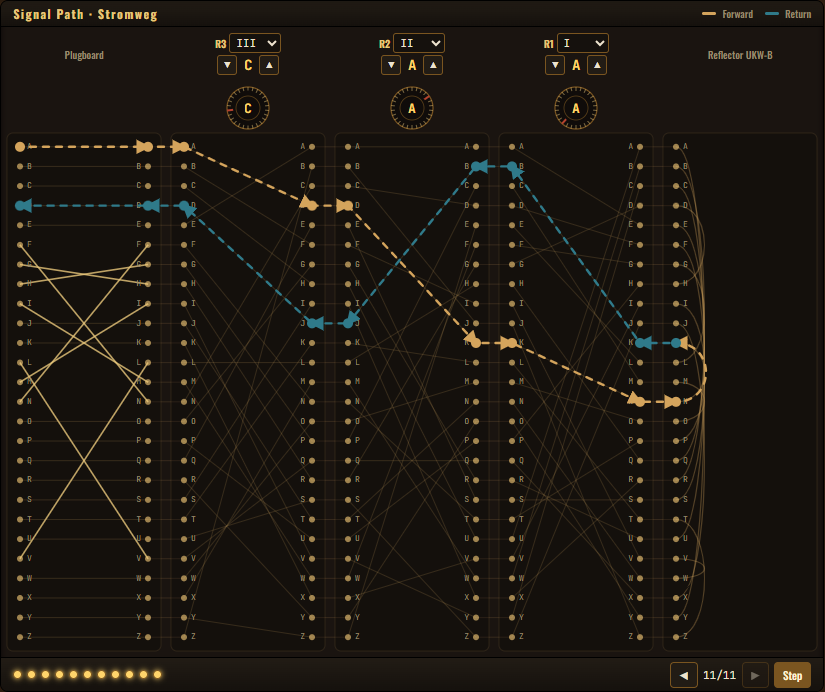
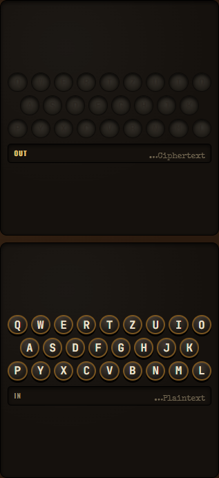
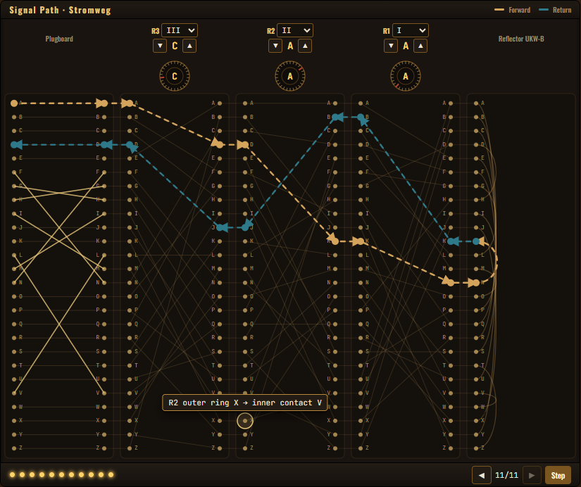
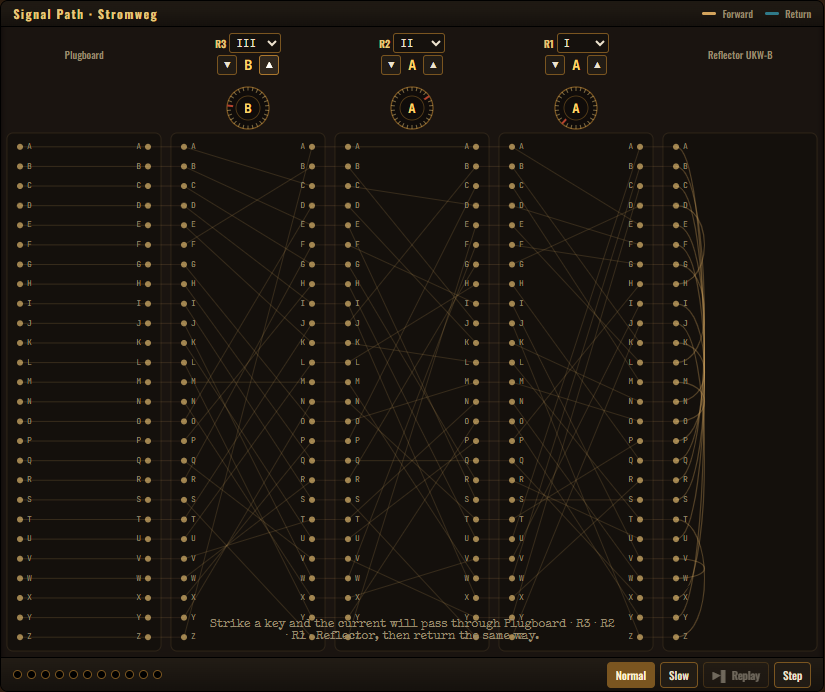
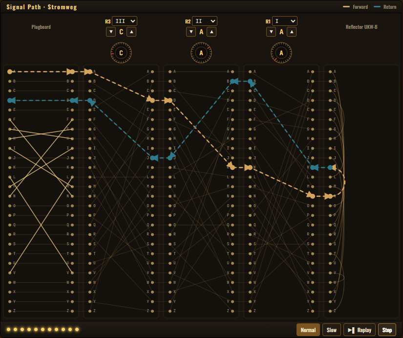

<div align="right">

🌐 **English** · [中文](docs_cn/README.md)

</div>

<div align="center">

# 🔐 Crypto Visualizer · Enigma

### ✨ Turn the most famous cipher machine of WWII — right in your browser ✨

**A runnable, watchable, touchable Enigma — a piece of cryptographic history, brought back to life in code.**

<p>
  
  
  
  
  
  
</p>



<sub><em>One window. No scrolling. Every plug, every rotor, every electrical path — all on stage at once.</em></sub>

[🚀 Quick Start](#-30-second-setup) · [📸 Gallery](#-what-it-looks-like) · [🧩 Project Layout](#-project-at-a-glance) · [📚 Docs](#-documentation) · [🤝 Contributing](#-contributing)

</div>

---

## 💡 What is this?

**Crypto Visualizer** is an **interactive cryptography playground**. We took the **Enigma machine** — the one that kept Bletchley Park's mathematicians awake at night — and put it inside your browser. No more black-box math: **every plug, every rotor, every electrical path** is something you can see, touch, and tweak.

> *"Encryption isn't magic — it's gears, wires, and a little bit of mechanical poetry."*

### 🎯 Why you'll love it

| | |
|---|---|
| 🖼️ **Single-viewport bento layout** | The whole machine lives on one screen — **no scrolling**, no hunting. Brass-on-walnut visual identity, every region in its place |
| 🔍 **The internals are the UI** | Five contact columns (`Plugboard · R3 · R2 · R1 · Reflector`) draw all 26 × 5 wires at once — you don't just *see the result*, you see **the geometry** |
| ⚡ **Watch the electron travel** | Press a key and a brass current snakes forward through the rotors, bounces off the reflector, and copper-cools its way home — with arrowheads so the direction is never ambiguous |
| 🎛️ **Faithful physical model** | Rotor stepping, the double-step anomaly, reflector symmetry, plugboard swaps — every historical quirk preserved |
| 🔌 **Plugboard reborn as a strip** | One clean row of 26 sockets, cables arcing above. Click-to-wire, click-to-pull |
| 🧪 **Clean modern stack** | React 18 + TypeScript on the front · FastAPI + Pydantic 3.13 on the back |
| ♿ **Built to be inspected** | Hover any contact for a plain-English mapping · Tab-navigable · respects `prefers-reduced-motion` |
| 🌐 **Bilingual UI** | Flip the whole interface between **English** and **中文** with one click in the topbar — labels, tooltips and the onboarding manual all follow |
| 📖 **Code as a textbook** | Curious about cryptography? FastAPI? React? Three tutorials in one repo |

---

## 🎬 What it looks like

> A 1918 cipher machine, **redrawn in brass and walnut for a 2025 browser.** Five stacked contact columns reveal the entire signal chain at once — no more guessing what's happening inside the box.

<table>
<tr>
<td width="50%" align="center">
  
  <br /><sub><b>🪵 At rest</b> — the five-column cross-section: <code>Plugboard · R3 · R2 · R1 · Reflector</code>. Every static wire is drawn faintly so the geometry of Enigma is always visible.</sub>
</td>
<td width="50%" align="center">
  
  <br /><sub><b>⚡ One key, ten hops</b> — brass for the forward path, cool copper for the return. Watch the electron retrace its way home through the reflector.</sub>
</td>
</tr>
<tr>
<td width="50%" align="center">
  
  <br /><sub><b>🔌 The plugboard strip</b> — a single row of 26 sockets, cables arcing above. Click two letters; the cable picks its own colour so crossings stay readable.</sub>
</td>
<td width="50%" align="center">
  
  <br /><sub><b>💡 Keyboard ↔ Lampboard</b> — input tape glued to the keys, output tape glued to the lamps. The text never wanders off to a footer.</sub>
</td>
</tr>
</table>

<details>
<summary><b>🔎 More: hover tooltips · step-through replay · single-step debugger</b></summary>

<br />

<table>
<tr>
<td width="33%" align="center">
  
  <br /><sub>Hover any of the 26 × 5 contacts to read its mapping in plain English: <code>R2 outer ring X → inner contact V</code>.</sub>
</td>
<td width="33%" align="center">
  
  <br /><sub>Single-step mode walks the trace one hop at a time — pause anywhere and inspect the geometry.</sub>
</td>
<td width="33%" align="center">
  
  <br /><sub>11 dots along the bottom = the full signal path. Scrub, replay, or slow it down.</sub>
</td>
</tr>
</table>

</details>

---

## ⚡ 30-second setup

> 💡 You'll need Node.js 16+ and Python 3.13.

### 1️⃣ Start the backend

<details open>
<summary><b>Windows PowerShell</b></summary>

```powershell
cd services\enigma-api
python -m venv .venv
.\.venv\Scripts\Activate.ps1
python -m pip install -r requirements.txt
python -m uvicorn app.main:app --reload
```
</details>

<details>
<summary><b>Linux / macOS</b></summary>

```bash
cd services/enigma-api
python3.13 -m venv .venv
source .venv/bin/activate
python -m pip install -r requirements.txt
python -m uvicorn app.main:app --reload
```
</details>

✅ The API runs at `http://localhost:8000`. Visit `/docs` for the auto-generated Swagger UI.

### 2️⃣ Start the frontend

```bash
cd apps/enigma-frontend
npm install
npm start
```

✅ Open `http://localhost:3000` and start your cryptographic journey.

> 💡 On first launch a 3-step **field manual** walks you through loading rotors, striking keys, and watching the current. Skip it any time — or reopen it from the **Manual** button in the topbar.

### 3️⃣ (Optional) Try the plugboard prototype alone

```bash
cd prototypes/plugboard-drag-demo
npm install
npm start
```

---

## 🧭 Project at a glance

```text
crypto-visualizer-enigma/
│
├─ 🎨 apps/
│   └─ enigma-frontend/        React + TypeScript · main UI
│
├─ ⚙️ services/
│   └─ enigma-api/             FastAPI + Pydantic · encryption engine
│
├─ 🧪 prototypes/
│   └─ plugboard-drag-demo/    Drag-to-wire plugboard sandbox
│
├─ 📚 docs/                    Architecture · API · Development · Layout (English)
├─ 🀄 docs_cn/                 Chinese translations
└─ 📜 specs/                   Business-logic tests & change plans
```

---

## 📚 Documentation

| What do you want to do? | Go here |
|---|---|
| 🏗️ Understand the architecture and data flow | [docs/architecture.md](docs/architecture.md) |
| 🔌 Look up API fields and examples | [docs/api.md](docs/api.md) |
| 🛠️ Set up the dev environment locally | [docs/development.md](docs/development.md) |
| 🗂️ See how the directories are organised | [docs/directory-layout.md](docs/directory-layout.md) |
| 🎨 Frontend module guide | [docs/enigma-frontend.md](docs/enigma-frontend.md) |
| ⚙️ Backend service guide | [docs/enigma-api.md](docs/enigma-api.md) |
| 🧪 Plugboard drag prototype | [docs/plugboard-drag-demo.md](docs/plugboard-drag-demo.md) |

🌏 **Prefer Chinese?** Full documentation is available in [`docs_cn/`](docs_cn/README.md).

---

## 🧠 A bit of history

> Enigma was invented by German engineer Arthur Scherbius in 1918 and adopted at scale by the Nazi military during WWII.
> British mathematician **Alan Turing** and his team at **Bletchley Park** broke it — an effort widely credited with
> **shortening the war by 2–4 years**, and giving birth to the very idea of a programmable computer: the **Turing machine**.

Turning that machine into a visual playground is our small tribute to that era and the people who lived through it.

---

## 🤝 Contributing

Whether you're a **cryptography enthusiast**, a **frontend / backend developer**, or just someone with a curious mind:

- ⭐ **Star this repo** — help others discover it
- 🐛 **Open an Issue** — report bugs or pitch ideas
- 🔧 **Send a PR** — every improvement is welcome
- 💬 **Start a discussion** — any cryptography question is fair game

---

## 📜 License

[MIT](LICENSE) © Crypto Visualizer Contributors

<div align="center">

**If this project sparked even a little curiosity, please give it a ⭐**

*Made with ❤️ for everyone curious about how secrets travel.*

</div>
