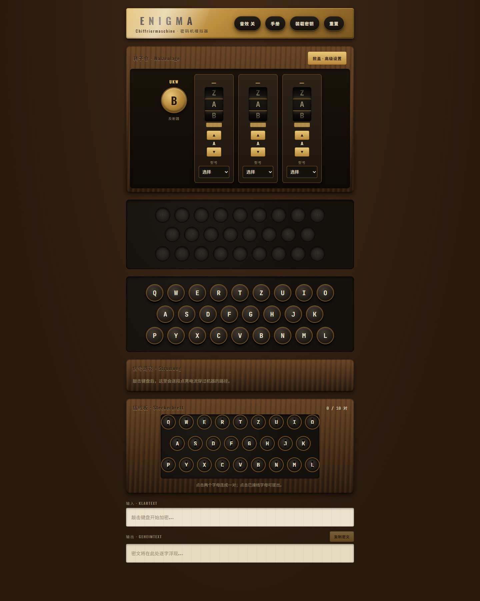
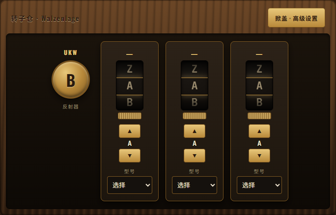

<div align="right">

🌐 **English** · [中文](../docs_cn/enigma-frontend.md)

</div>

<div align="center">

# 🎨 Enigma Frontend

### A 1918 cipher machine, drawn into a 2025 browser.

<p>
  
  
  
</p>

</div>

---

## 📸 Screenshots

<p align="center">
  
</p>

<p align="center">
  <em>The full UI: rotor row, lampboard, keyboard, signal-path panel, plugboard, input/output strip.</em>
</p>

---

## ✨ What is this?

The **main UI** of the Enigma Visualizer — a React + TypeScript interactive surface that lets you:

- 🎛️ Rotate rotors, switch reflectors
- 🔌 **Drag cables** on the plugboard
- ⌨️ Press the on-screen keyboard and watch the lampboard light up
- 🔍 Trace every current path through Enigma's internals

---

## 🎛️ Anatomy

### Rotor row



The reflector (UKW B) and three rotors. Each rotor lets you pick the model from a dropdown, scroll its visible letters, or step it with the ▲ / ▼ buttons.

### Plugboard


Tap two letters to wire a pair; tap a wired letter again to remove the cable.


A wired plugboard — two pairs connected (`A ↔ M`, `C ↔ Z`). The counter on the right tracks usage out of the historical 10-pair limit.

---

## 🚀 Get started

```bash
cd apps/enigma-frontend
npm install
npm start
```

Open [http://localhost:3000](http://localhost:3000) and start typing.

> 💡 By default it talks to the backend at:
> ```
> http://localhost:8000
> ```
> Start [enigma-api](enigma-api.md) first.

---

## 🧩 Directory tour

```text
apps/enigma-frontend/src/
├─ 🧱 components/        Rotor · Reflector · Plugboard · Keyboard · Lampboard
├─ 🛰️  services/api.ts   Backend API client
└─ 🚪 App.tsx            Application root
```

| Path | Responsibility |
|---|---|
| [apps/enigma-frontend/src/components](../apps/enigma-frontend/src/components) | Visual parts (Rotor / Reflector / Plugboard / Keyboard / Lampboard) |
| [apps/enigma-frontend/src/services/api.ts](../apps/enigma-frontend/src/services/api.ts) | Calls `/rotors`, `/reflectors`, `/encrypt` |
| [apps/enigma-frontend/src/App.tsx](../apps/enigma-frontend/src/App.tsx) | Top-level composition & state |

---

## 🛠️ Common scripts

| Command | What it does |
|---|---|
| `npm start` | Dev server on port 3000 |
| `npm run build` | Production build into `build/` |
| `npm test` | Run unit tests |

---

## 🔗 Related docs

- 🏗️ [Architecture](architecture.md)
- 🔌 [API reference](api.md)
- 🛠️ [Development guide](development.md)
