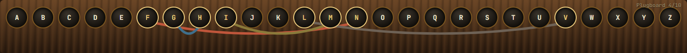

<div align="right">

🌐 **English** · [中文](../docs_cn/plugboard-drag-demo.md)

</div>

<div align="center">

# 🧪 Plugboard Drag Demo

### 🔌 A tiny standalone sandbox: draw a cable between any two letters with your mouse.

</div>

---

## ✨ What is it?

The smallest runnable prototype of Enigma's **plugboard drag-to-wire** interaction.

> No backend, no encryption — just answering one question: **does dragging a cable feel right?**

<p align="center">
  
</p>

<p align="center">
  <em>The plugboard as it ships today in the main app: 26 sockets in a single row, cables arcing as half-circles above. Four pairs wired here (<code>F ↔ N</code>, <code>G ↔ H</code>, <code>I ↔ M</code>, <code>L ↔ V</code>) — each gets its own colour so crossings stay legible. The counter on the right tracks the historical 10-pair limit.</em>
</p>

> 💡 The screenshot above is the production plugboard inside [`apps/enigma-frontend`](../apps/enigma-frontend/). This standalone prototype was the sandbox where its **drag-to-connect** mechanics were tuned before being folded into the real machine.

---

## 🚀 Get started

```bash
cd prototypes/plugboard-drag-demo
npm install
npm start
```

In the browser, **press a letter, drag to another, release** to create a connection. Click an existing cable to remove it.

---

## 🎯 Who is it for?

- Anyone implementing **drag-to-connect** interactions in React
- Cryptography fans who want to dissect the **plugboard UX** without encryption noise
- Contributors looking for a **sandbox** to validate UX changes before touching the full app

---

## 👉 Where's the full version?

The complete Enigma simulator lives at:
📦 [`apps/enigma-frontend`](../apps/enigma-frontend/) · see [enigma-frontend.md](enigma-frontend.md)

That's where the real encryption, lampboard, rotors and backend integration are.
