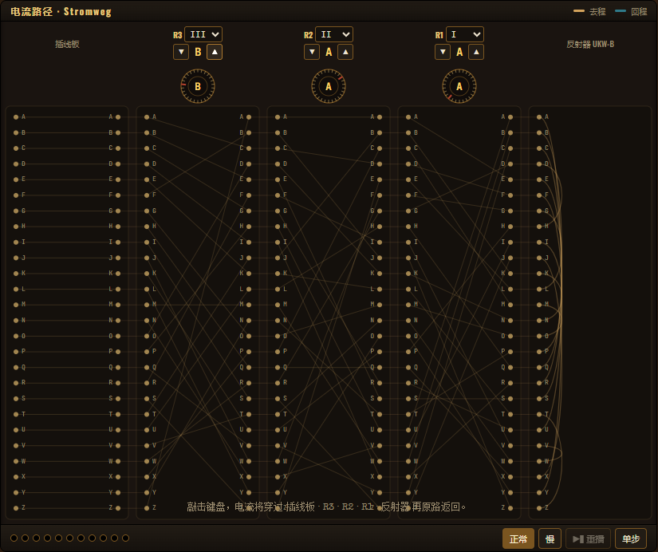
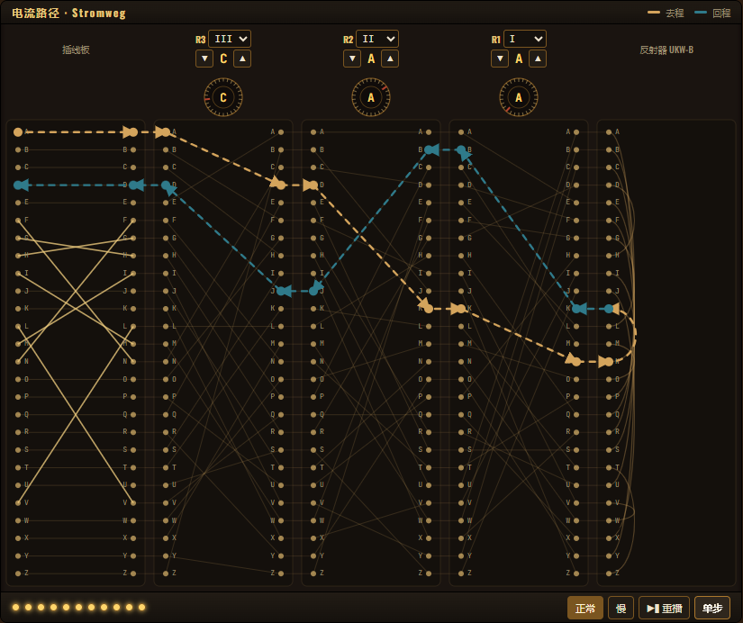

<div align="right">

[English](../README.md) · 🌐 **中文**

</div>

<div align="center">

# 🔐 Crypto Visualizer · Enigma

### ✨ 在浏览器里，亲手转动二战最神秘的密码机 ✨

**一台跑得起来、看得见、摸得着的 Enigma —— 用代码复刻一段改变历史的密码学传奇**

<p>
  
  
  
  
  
  
</p>


<sub><em>一个窗口、不滚动、所有插线 / 转子 / 电流路径同框登场。</em></sub>

[🚀 快速启动](#-30-秒上手) · [📸 画廊](#-它长这样) · [🧩 项目结构](#-项目全貌) · [📚 文档](#-文档导航) · [🤝 参与贡献](#-参与贡献)

</div>

---

## 💡 这是什么？

**Crypto Visualizer** 是一个 **交互式密码学可视化** 项目。我们把那台曾让英国 Bletchley Park 数学家彻夜难眠的 **Enigma 密码机** 搬进了浏览器 —— 不再是黑盒公式，而是**每一根插线、每一个转子、每一束电流路径**都看得见、点得到、改得了。

> *"加密不是魔法，是齿轮、电流和一点点机械的浪漫。"*

### 🎯 为什么你会喜欢它？

| | |
|---|---|
| 🖼️ **单视口 Bento 布局** | 整台机器装进一屏 —— **不滚动、不找角**。黄铜配胡桃木，每个区域各就其位 |
| 🔍 **内部就是界面** | 五列触点（`插线板 · R3 · R2 · R1 · 反射器`）一次画满 26 × 5 根线，你看到的不只是"结果"，而是 Enigma 的**几何结构本身** |
| ⚡ **看着电子穿过机器** | 按下一键，去程沿黄铜色顺势深入；反射器一弹后，回程换成冷铜青色返回 —— 箭头明确，去回不混淆 |
| 🎛️ **真实物理模型** | 转子步进、双步异常、反射器对称、插线板交换 —— 历史细节逐一还原 |
| 🔌 **插线板变身长条** | 26 个插孔横向单行排列，跳线在上方画弧。点两下连线、点一下拔线 |
| 🧪 **干净的现代栈** | React 18 + TypeScript 前端 · FastAPI + Pydantic / Python 3.13 后端 |
| ♿ **为"被研究"而设计** | 鼠标悬停任意触点立刻显示中文映射 · Tab 全键盘可达 · 尊重 `prefers-reduced-motion` |
| 🌐 **中英双语界面** | 顶栏一键切换 **English** / **中文** —— 标签、提示、新手引导手册全部跟着变 |
| 📖 **代码即教材** | 想懂 Enigma？想学 FastAPI？想练 React？三合一开源教程 |

---

## 🎬 它长这样

> 把 1918 年的密码机，**用黄铜与胡桃木重画到 2025 年的浏览器里。** 五列触点同时摊开整条信号链，你不用再猜机器内部到底在发生什么。

<table>
<tr>
<td width="50%" align="center">
  
  <br /><sub><b>🪵 待机状态</b> —— 五列横截面：<code>插线板 · R3 · R2 · R1 · 反射器</code>。所有静态接线都以淡色一并呈现，Enigma 的几何结构始终可见。</sub>
</td>
<td width="50%" align="center">
  
  <br /><sub><b>⚡ 一键十段</b> —— 去程黄铜色、回程冷铜青色，亲眼看电子从键盘一路深入，再经反射器折返灯板。</sub>
</td>
</tr>
<tr>
<td width="50%" align="center">
  
  <br /><sub><b>🔌 插线板长条</b> —— 26 插孔单行排列，跳线在上方画弧。点两个字母即连线，每根电缆自动配色，交叉处不再混淆。</sub>
</td>
<td width="50%" align="center">
  
  <br /><sub><b>💡 键盘 ↔ 灯板</b> —— 输入文本带贴在键盘下方、输出文本带贴在灯板下方，永远不会跑到页脚去找。</sub>
</td>
</tr>
</table>

<details>
<summary><b>🔎 更多细节：触点悬停 · 单步调试 · 重播时间轴</b></summary>

<br />

<table>
<tr>
<td width="33%" align="center">
  
  <br /><sub>鼠标悬停任意触点，立刻显示当前映射：<code>R2 外环 X → 内触点 V</code>。</sub>
</td>
<td width="33%" align="center">
  
  <br /><sub>单步模式逐段揭示电流路径，停在任何一步都能慢慢拆解。</sub>
</td>
<td width="33%" align="center">
  
  <br /><sub>底部 11 个圆点 = 完整信号链。可任意拖动、重播、放慢。</sub>
</td>
</tr>
</table>

</details>

---

## ⚡ 30 秒上手

> 💡 需要 Node.js 16+ 与 Python 3.13。

### 1️⃣ 启动后端

<details open>
<summary><b>Windows PowerShell</b></summary>

```powershell
cd services\enigma-api
python -m venv .venv
.\.venv\Scripts\Activate.ps1
python -m pip install -r requirements.txt
python -m uvicorn app.main:app --reload
```
</details>

<details>
<summary><b>Linux / macOS</b></summary>

```bash
cd services/enigma-api
python3.13 -m venv .venv
source .venv/bin/activate
python -m pip install -r requirements.txt
python -m uvicorn app.main:app --reload
```
</details>

✅ 后端默认运行在 `http://localhost:8000`，访问 `/docs` 即可看到自动生成的 Swagger UI。

### 2️⃣ 启动前端

```bash
cd apps/enigma-frontend
npm install
npm start
```

✅ 浏览器打开 `http://localhost:3000`，开始你的密码之旅。

> 💡 首次启动会弹出三步**操作手册**，带你装载转子、敲击按键、观察电流。随时可跳过 —— 也能从顶栏的**手册**按钮重新打开。

### 3️⃣ （可选）单独玩插线板拖拽原型

```bash
cd prototypes/plugboard-drag-demo
npm install
npm start
```

---

## 🧭 项目全貌

```text
crypto-visualizer-enigma/
│
├─ 🎨 apps/
│   └─ enigma-frontend/        React + TypeScript · 主前端 UI
│
├─ ⚙️ services/
│   └─ enigma-api/             FastAPI + Pydantic · 加密引擎
│
├─ 🧪 prototypes/
│   └─ plugboard-drag-demo/    插线板拖拽交互原型
│
├─ 📚 docs/                    架构 · API · 开发 · 目录说明（英文）
├─ 🀄 docs_cn/                 中文文档（你正在这里）
└─ 📜 specs/                   业务逻辑测试与改造记录
```

---

## 📚 文档导航

| 想做什么？ | 看这里 |
|---|---|
| 🏗️ 了解整体架构和数据流 | [architecture.md](architecture.md) |
| 🔌 查询接口字段和示例 | [api.md](api.md) |
| 🛠️ 在本地搭好开发环境 | [development.md](development.md) |
| 🗂️ 看懂目录组织规则 | [directory-layout.md](directory-layout.md) |
| 🎨 前端模块说明 | [enigma-frontend.md](enigma-frontend.md) |
| ⚙️ 后端服务说明 | [enigma-api.md](enigma-api.md) |
| 🧪 插线板原型 | [plugboard-drag-demo.md](plugboard-drag-demo.md) |

🌍 **想看英文版？** 完整英文文档见仓库根目录的 [`README.md`](../README.md) 和 [`docs/`](../docs/)。

---

## 🧠 一点历史小料

> Enigma 由德国工程师 Arthur Scherbius 于 1918 年发明，二战期间被纳粹德国军方大规模使用。
> 英国数学家 **Alan Turing** 和 Bletchley Park 团队破译 Enigma，被估计**让二战提前 2~4 年结束**，
> 也直接催生了现代计算机科学的雏形 —— **图灵机**。

把它做成可视化工具，是我们对那段历史与那群人最朴素的致敬。

---

## 🤝 参与贡献

无论你是 **密码学爱好者**、**前端/后端开发者**，还是只是好奇心旺盛的学生：

- ⭐ **Star 一下** —— 让更多人看到这个项目
- 🐛 **提 Issue** —— 报告 bug 或提出新点子
- 🔧 **发 PR** —— 我们欢迎一切优化与扩展
- 💬 **聊一聊** —— 你对密码学的任何问题都欢迎来 Discussion 里抛出来

---

## 📜 License

[MIT](../LICENSE) © Crypto Visualizer Contributors

<div align="center">

**如果这个项目让你对密码学多了一分兴趣，请给我们一个 ⭐**

*Made with ❤️ for everyone curious about how secrets travel.*

</div>
