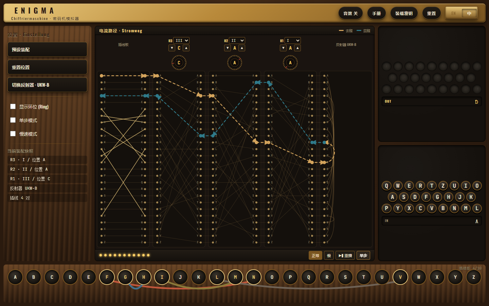
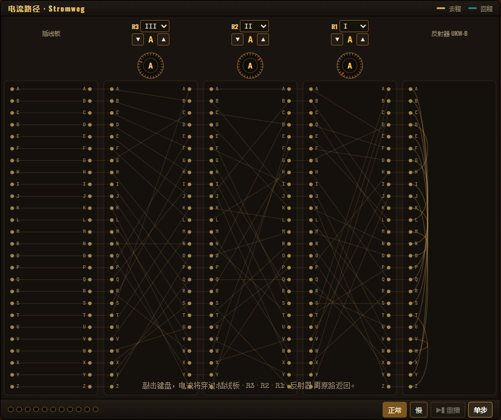
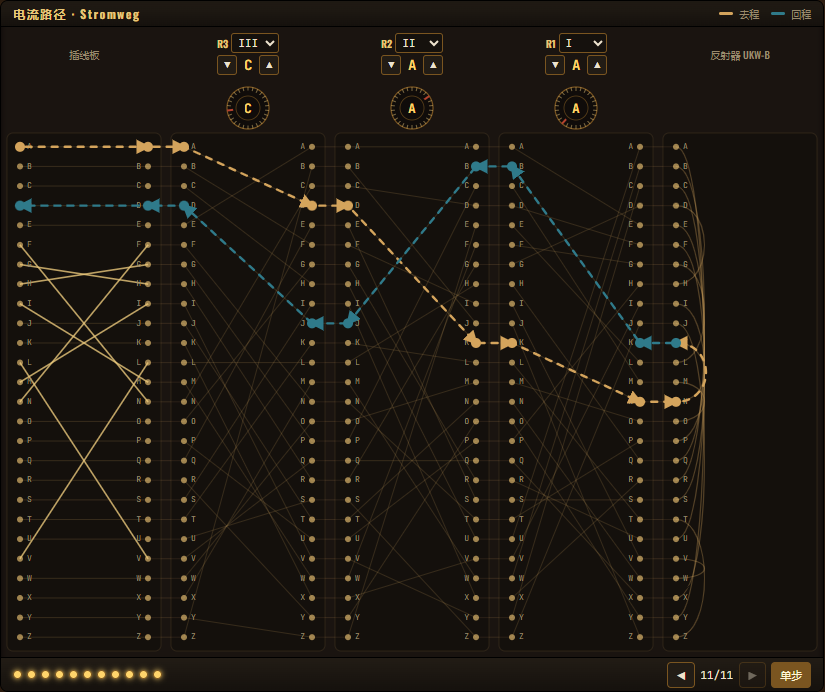
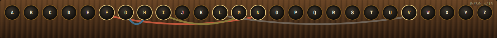
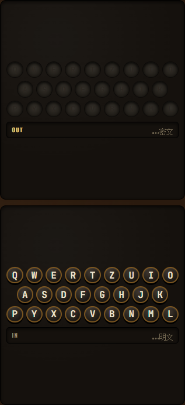
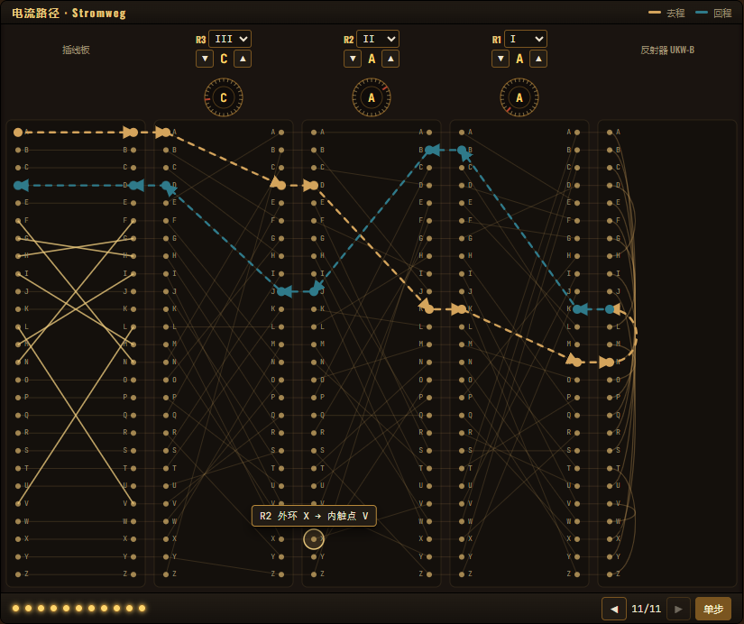

<div align="right">

[English](../docs/enigma-frontend.md) · 🌐 **中文**

</div>

<div align="center">

# 🎨 Enigma Frontend

### 把一台 1918 年的密码机，用黄铜与胡桃木画进 2025 年的浏览器

<p>
  
  
  
  
</p>



<sub><em>整台机器装进一个屏幕，不滚动、不藏面板。</em></sub>

</div>

---

## ✨ 这是什么？

Enigma Visualizer 的 **主前端**：用 React + TypeScript 写成的交互式 UI，让你可以——

- 🎛️ 切换转子型号、用 ▲ / ▼ 滚动位置、切换反射器
- 🔌 在底部 26 插孔长条上**接插线**
- ⌨️ 点屏幕键盘，或直接按物理键盘 —— 灯板会回应你
- ⚡ **看着电流穿过五列触点** —— 去程黄铜色、回程冷铜青色
- 🔍 鼠标悬停 26 × 5 个触点，立刻显示中文映射
- ⏯️ 完整重播、单步调试、慢速放映
- 🌐 在顶栏一键切换 **English** / **中文** 界面

---

## 🗺️ 布局 · Bento 栅格

桌面端（`≥ 760 px`）使用**固定的三行三列栅格**，恰好填满一屏，**绝不出现滚动条**：

```
┌──────────────────────────────────────────────────────────────────────┐
│ TOPBAR (56px)   ENIGMA · 声音 · 手册 · 装载密钥 · 重置 · EN|中         │
├────────────┬─────────────────────────────────────┬───────────────────┤
│ 配置栏     │            机器核心 MachineCore     │    灯板           │
│ ConfigRail │     (5 列触点 + 静态接线 +          │   + 输出文本带     │
│ 240–288px  │      实时电流路径 + 步进时间轴)     ├───────────────────┤
│            │                                     │    键盘           │
│            │                                     │   + 输入文本带     │
├────────────┴─────────────────────────────────────┴───────────────────┤
│ 插线板长条 — 26 插孔单行，跳线在上方画弧                              │
└──────────────────────────────────────────────────────────────────────┘
```

> 📱 窄屏（`< 760 px`）回退为纵向堆叠 + 旧版 11 节点 SignalPath。

---

## 🎛️ 各部件

### 🪵 机器核心 · 五列触点

<p align="center">
  
</p>

整次重设计的灵魂。每一列都画出 Enigma 信号链中某一级的**全部 26 个触点和 26 根内部接线**：

| 列 | 内容 |
|---|---|
| **PB** · 插线板 | 26 字母交换表；已连线的跳线显示为对应电缆颜色 |
| **R3 / R2 / R1** · 转子 | 当前选中型号的 wiring，按 `position` 旋转、按 `ringSetting` 偏移 |
| **UKW** · 反射器 | 13 对对偶配线，用贝塞尔弧呈现（`A↔E`、`B↔J`……） |

每个转子列上方有：型号下拉、位置 ▲▼，以及一个**同心环 chip** —— 一眼分清"字母环"和"触点环"。

### ⚡ 实时电流路径

<p align="center">
  
</p>

按下一键，你看到的是**真实穿过机器的十段路径**，而不是抽象节点列表：

- 🟡 **去程**（黄铜色，`→` 箭头）：`键盘 → PB → R3 → R2 → R1 → UKW`
- 🔵 **回程**（冷铜青色，`←` 箭头）：`UKW → R1 → R2 → R3 → PB → 灯板`

方向用**颜色 + 箭头**双重编码，在任何色觉条件下都不会混淆。底部 11 个圆点的时间轴让你拖、放、单步随心切换。

### 🔌 插线板长条

<p align="center">
  
</p>

老式三排插线板被压缩为**单行 26 个插孔**，跳线在上方画半圆弧。点两个字母即接通，再点已连线字母即拔出。每根电缆自动从 10 色调色盘里取色，交叉处依然分明。右上角实时显示**历史上限 10 对**的使用计数（上图是 `4 / 10`）。

### 💡 右栏 · 灯板与键盘 + 文本带

<p align="center">
  
</p>

右栏把文本带和它对应的设备绑在一起：

- **上半**：灯板（QWERTZ 灯泡）+ **`OUT` 文本带** —— 最新密文始终贴右
- **下半**：屏幕键盘（或直接按物理键）+ **`IN` 文本带** —— 最新明文始终贴右

文本带用 `direction: rtl` 让新字符从右侧滑入，永远不会出滚动条。

### 🛠️ 左栏 · 配置栏

极简的全局动作面板 —— 预设、重置、反射器循环切换，加上**环位模式**、**单步**、**慢速**三个开关。每个转子的型号 / 位置控件**不再**重复出现在这里 —— 它们在 Core 列顶。

### 🔎 触手可及的几何

<p align="center">
  
</p>

鼠标悬停（或 Tab 聚焦）任意一个触点 → 立刻显示中文映射，例如 `R2 外环 X → 内触点 V`。提示气泡支持 `aria-live="polite"`，并尊重 `prefers-reduced-motion`。

### 🌐 双语界面与新手引导

整个界面支持中英双语。顶栏的 **`EN` / `中`** 切换钮会把每一处标签、提示、说明在英文与简体中文之间整体翻转 —— 由 `react-i18next` 驱动，选择存入 `localStorage["enigma-lang"]`（默认英文）。

首次访问时会弹出**三步操作手册** —— 一张黄铜质感的"操作卡"，带新手依次走完装载转子、敲击按键、观察电流。可随时跳过，可从顶栏**手册**按钮重新打开，关闭状态记于 `localStorage["enigma-onboarded"]`。

---

## 🚀 启动

```bash
cd apps/enigma-frontend
npm install
npm start
```

浏览器打开 [http://localhost:3000](http://localhost:3000)，开始按键。

> 💡 前端默认调用 `http://localhost:8000`。请先启动 [enigma-api](enigma-api.md) 服务。

---

## 🧩 目录速览

```text
apps/enigma-frontend/src/
├─ 🧱 components/
│   ├─ EnigmaSimulator.tsx          ← Bento 栅格容器
│   ├─ LanguageSwitcher.tsx         ← 顶栏 EN / 中 切换钮
│   ├─ onboarding/
│   │   └─ Onboarding.tsx           ← 首次访问的三步操作手册
│   └─ machine/
│      ├─ MachinePlate.tsx          ← 顶栏（标题 + 动作 + 语言）
│      ├─ MachineCore.tsx           ← 5 列核心 + 电流路径
│      ├─ ContactColumn.tsx         ← 单列 = 26 触点 + 接线
│      ├─ ConfigRail.tsx            ← 左侧全局动作栏
│      ├─ Plugboard.tsx             ← 底部 26 插孔长条
│      ├─ Rotor.tsx · RotorBank.tsx · Reflector.tsx
│      ├─ LampBoard.tsx + Keyboard.tsx
│      ├─ TapeDisplay.tsx           ← 输入 / 输出文本带
│      ├─ SignalPath.tsx            ← 旧版 11 节点（窄屏回退）
│      └─ signal.ts · core.ts · layout.ts
├─ 🪝 hooks/
│   ├─ useMediaQuery.ts             ← 窄屏检测
│   ├─ usePhysicalKeyboard.ts       ← 物理键盘输入
│   └─ useSound.ts                  ← 按键 / 灯泡音效
├─ 🌐 i18n/
│   ├─ index.ts                     ← react-i18next 初始化
│   └─ locales/en.json · zh-CN.json ← 界面文案
├─ 🛰️  services/api.ts              ← 后端调用封装
└─ 🚪 index.tsx                     ← 应用入口
```

| 路径 | 职责 |
|---|---|
| `components/EnigmaSimulator.tsx` | 顶层栅格容器 + 状态管理 |
| `components/machine/MachineCore.tsx` | 五列横截面 + 电流路径动画 |
| `components/machine/ContactColumn.tsx` | 单列 = 26 触点 + 列内接线 |
| `components/machine/Plugboard.tsx` | 底部 26 插孔长条 |
| `components/machine/ConfigRail.tsx` | 全局动作 + 高级开关 |
| `services/api.ts` | 调用 `/api/rotors` `/api/reflectors` `/api/encrypt` |

---

## 🎨 视觉语言

| Token | 用途 |
|---|---|
| `--brass-light` `#d4a45c` | 去程电流、触点亮色、聚焦环 |
| `--copper-cool` `#2f7a8a` | 经反射器折返后的回程电流 |
| `--wire-static` `rgba(212,164,92,0.15)` | 始终呈现的 130 根静态接线 |
| `--core-bg` `#1a1410` | 机器核心面板底色 |
| `--notch` `#b3422e` | 转子字母环上的红色缺口 |

所有 token 集中在 [`styles/tokens.css`](../apps/enigma-frontend/src/styles/tokens.css) —— 改一处，整机换装。

---

## 🛠️ 常用脚本

| 命令 | 作用 |
|---|---|
| `npm start` | 启动开发服务器（默认 3000 端口） |
| `npm run build` | 构建生产产物到 `build/` |
| `npm test` | 运行单元测试 |

---

## 🔗 相关文档

- 🏗️ [整体架构](architecture.md)
- 🔌 [API 字段说明](api.md)
- 🛠️ [开发指南](development.md)
- 🧪 [插线板拖拽原型](plugboard-drag-demo.md)
