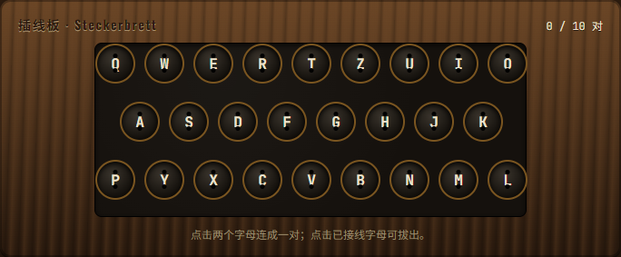
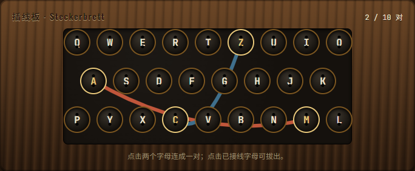

<div align="right">

[English](../docs/plugboard-drag-demo.md) · 🌐 **中文**

</div>

<div align="center">

# 🧪 Plugboard Drag Demo

### 🔌 一个独立的小沙盒：用鼠标在 A–Z 之间拉一根线

</div>

---

## ✨ 它是什么？

Enigma **插线板（Plugboard）拖拽连线**的最小可运行原型。

> 不连接后端、不跑加密 —— 只验证一件事：**鼠标拖动产生的"插线"交互够不够顺手。**

<p align="center">
  
</p>

<p align="center">
  <em>未接线的板子：26 个插孔按 QWERTZ 排布，等着第一根电缆。</em>
</p>

<p align="center">
  
</p>

<p align="center">
  <em>连了两对之后（<code>A ↔ M</code>、<code>C ↔ Z</code>）—— 每根电缆有自己的颜色，便于交叉时分辨。</em>
</p>

> 💡 上面的截图取自正式版前端的插线板，使用与本原型相同的交互模型。

---

## 🚀 启动

```bash
npm install
npm start
```

打开浏览器，**按住任意字母往另一个字母拖**，松手即建立连接。再点一次连线可断开。

---

## 🎯 适合谁？

- 想在 **React** 里实现拖拽连线交互的同学
- 想拆解 Enigma 插线板**交互逻辑**而不被加密细节干扰的爱好者
- 给完整版前端做 **UX 验证沙盒** 的贡献者

---

## 👉 正式版在哪里？

完整的 Enigma 模拟器位于：
📦 [`apps/enigma-frontend`](../apps/enigma-frontend/)

那里有真正的加密、灯板、转子，以及和后端的完整对接。
